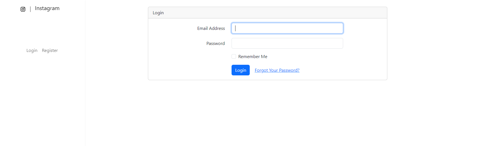
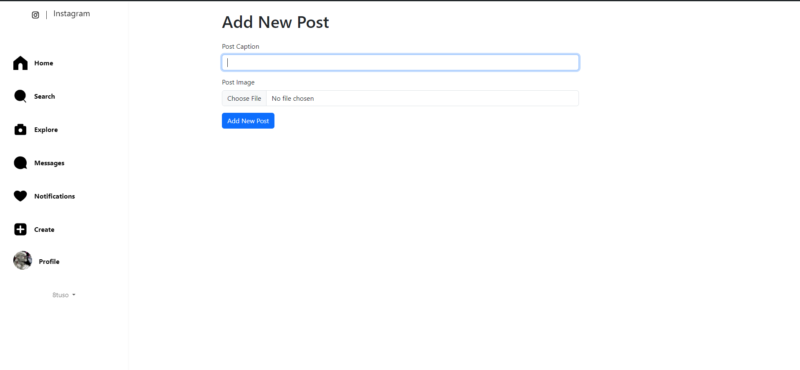

## About The Website

# Instagram Clone

This project is a web application clone of Instagram, created to mimic the core functionalities of the popular social media platform. Below is a brief explanation of the implemented features as well as those that are planned but not yet deployed.

## Features

### 1. User Registration and Authentication

- **User Creation:** Users can sign up by creating an account with a unique username, email, and password. The application securely stores user credentials using hashed passwords.

- **Login/Logout:** Users can log in with their credentials and log out when done, with sessions managed to ensure a smooth experience.

### 2. Uploading Posts

- **Post Creation:** Users can upload images to share with their followers. Each post includes a caption, which users can edit at the time of posting.

- **Post Management:** Users can view their posts on their profile page, which displays all their uploads in a grid format.

### 3. Commenting on Posts

- **Comments:** Users can add comments to posts, facilitating interaction and discussion around the content. Comments are displayed in chronological order below each post.

### 4. Home Page

- **Feed Display:** The home page shows a feed of posts from users that the logged-in user is following, providing an engaging experience similar to the Instagram home feed.
- **Pagination:** The feed supports pagination, allowing users to load more content as they scroll down.

### 5. Following Users

- **Follow/Unfollow:** Users can follow other users to see their posts in their feed. This feature encourages social interaction and content discovery within the app.

## Features Not Yet Deployed

### 1. Likes
- **Like Posts:** The ability for users to like posts is planned. This feature will allow users to express their appreciation for content and will display a count of likes on each post.

### 2. Replying to Comments
- **Comment Replies:** Users will soon be able to reply to comments, enabling threaded discussions within the comments section.

### 3. Notifications
- **User Notifications:** Notifications for likes, comments, follows, and replies are planned to enhance user engagement. This will help users stay updated with interactions on their posts and account.

## About Laravel

Laravel is a web application framework with expressive, elegant syntax. We believe development must be an enjoyable and creative experience to be truly fulfilling. Laravel takes the pain out of development by easing common tasks used in many web projects, such as:

- [Simple, fast routing engine](https://laravel.com/docs/routing).
- [Powerful dependency injection container](https://laravel.com/docs/container).
- Multiple back-ends for [session](https://laravel.com/docs/session) and [cache](https://laravel.com/docs/cache) storage.
- Expressive, intuitive [database ORM](https://laravel.com/docs/eloquent).
- Database agnostic [schema migrations](https://laravel.com/docs/migrations).
- [Robust background job processing](https://laravel.com/docs/queues).
- [Real-time event broadcasting](https://laravel.com/docs/broadcasting).

Laravel is accessible, powerful, and provides tools required for large, robust applications.

## Learning Laravel

Laravel has the most extensive and thorough [documentation](https://laravel.com/docs) and video tutorial library of all modern web application frameworks, making it a breeze to get started with the framework.

You may also try the [Laravel Bootcamp](https://bootcamp.laravel.com), where you will be guided through building a modern Laravel application from scratch.

If you don't feel like reading, [Laracasts](https://laracasts.com) can help. Laracasts contains thousands of video tutorials on a range of topics including Laravel, modern PHP, unit testing, and JavaScript. Boost your skills by digging into our comprehensive video library.

## Laravel Sponsors

We would like to extend our thanks to the following sponsors for funding Laravel development. If you are interested in becoming a sponsor, please visit the [Laravel Partners program](https://partners.laravel.com).

### Premium Partners

- **[Vehikl](https://vehikl.com/)**
- **[Tighten Co.](https://tighten.co)**
- **[WebReinvent](https://webreinvent.com/)**
- **[Kirschbaum Development Group](https://kirschbaumdevelopment.com)**
- **[64 Robots](https://64robots.com)**
- **[Curotec](https://www.curotec.com/services/technologies/laravel/)**
- **[Cyber-Duck](https://cyber-duck.co.uk)**
- **[DevSquad](https://devsquad.com/hire-laravel-developers)**
- **[Jump24](https://jump24.co.uk)**
- **[Redberry](https://redberry.international/laravel/)**
- **[Active Logic](https://activelogic.com)**
- **[byte5](https://byte5.de)**
- **[OP.GG](https://op.gg)**

## Contributing

Thank you for considering contributing to the Laravel framework! The contribution guide can be found in the [Laravel documentation](https://laravel.com/docs/contributions).

## Code of Conduct

In order to ensure that the Laravel community is welcoming to all, please review and abide by the [Code of Conduct](https://laravel.com/docs/contributions#code-of-conduct).

## Security Vulnerabilities

If you discover a security vulnerability within Laravel, please send an e-mail to Taylor Otwell via [taylor@laravel.com](mailto:taylor@laravel.com). All security vulnerabilities will be promptly addressed.

## License

The Laravel framework is open-sourced software licensed under the [MIT license](https://opensource.org/licenses/MIT).
